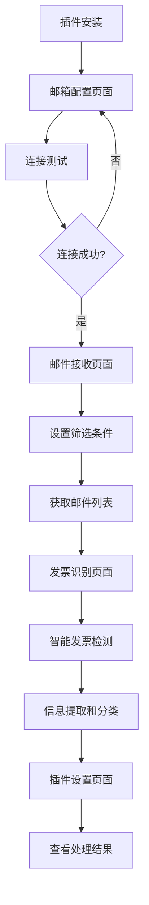

# Coze邮箱插件产品需求文档

## 1. Product Overview

Coze邮箱插件是一个智能邮件接收和处理工具，专门为Coze平台设计，能够连接主流邮箱服务并自动识别发票邮件。

- 解决用户需要手动检查邮箱中发票邮件的痛点，提供自动化的邮件筛选和识别功能
- 目标用户为需要处理大量邮件和发票的企业用户和个人用户，帮助提高工作效率

## 2. Core Features

### 2.1 User Roles

| Role | Registration Method | Core Permissions |
|------|---------------------|------------------|
| 普通用户 | Coze平台授权 | 可配置邮箱连接，接收和查看邮件 |
| 企业用户 | Coze平台企业账号 | 可批量处理邮件，设置高级筛选规则 |

### 2.2 Feature Module

我们的Coze邮箱插件包含以下主要功能模块：

1. **邮箱配置页面**：邮箱连接设置，服务器参数配置，认证管理
2. **邮件接收页面**：邮件列表展示，筛选条件设置，实时同步
3. **发票识别页面**：智能发票检测，发票信息提取，分类管理
4. **插件设置页面**：参数配置，规则定制，日志查看

### 2.3 Page Details

| Page Name | Module Name | Feature description |
|-----------|-------------|---------------------|
| 邮箱配置页面 | 连接设置 | 配置邮箱地址、密码、IMAP服务器、端口等连接参数，支持SSL加密 |
| 邮箱配置页面 | 服务器预设 | 提供QQ邮箱、163邮箱等主流邮箱的预设配置模板 |
| 邮箱配置页面 | 连接测试 | 验证邮箱连接是否成功，显示连接状态和错误信息 |
| 邮件接收页面 | 邮件列表 | 显示收件箱邮件列表，包含发件人、主题、时间、附件信息 |
| 邮件接收页面 | 筛选条件 | 设置邮件筛选参数：发件人、时间范围、邮件数量限制 |
| 邮件接收页面 | 实时同步 | 自动获取最新邮件，支持手动刷新和定时同步 |
| 发票识别页面 | 智能检测 | 自动识别邮件中的发票内容，标记发票邮件 |
| 发票识别页面 | 信息提取 | 提取发票关键信息：发票号码、金额、开票日期、开票方 |
| 发票识别页面 | 分类管理 | 对识别的发票进行分类整理，支持导出功能 |
| 插件设置页面 | 参数配置 | 设置插件运行参数，包括同步频率、识别规则等 |
| 插件设置页面 | 日志查看 | 显示插件运行日志，包括连接状态、处理记录、错误信息 |

## 3. Core Process

### 普通用户流程
1. 用户在Coze平台安装邮箱插件
2. 配置邮箱连接参数（邮箱地址、密码、服务器信息）
3. 测试邮箱连接是否成功
4. 设置邮件筛选条件（时间范围、发件人等）
5. 启动邮件接收和发票识别功能
6. 查看识别结果和发票信息

### 企业用户流程
1. 企业管理员配置多个邮箱账号
2. 设置批量处理规则和高级筛选条件
3. 启动自动化邮件处理流程
4. 查看汇总报告和发票统计信息

## 4. User Interface Design

### 4.1 Design Style

- **主色调**：Coze品牌蓝色 (#1890FF)，辅助色为浅灰色 (#F5F5F5)
- **按钮样式**：圆角矩形按钮，支持悬停效果和点击反馈
- **字体**：系统默认字体，标题使用16px，正文使用14px，说明文字使用12px
- **布局风格**：卡片式布局，左侧导航栏，右侧内容区域
- **图标风格**：使用简洁的线性图标，支持邮件、设置、刷新等常用操作

### 4.2 Page Design Overview

| Page Name | Module Name | UI Elements |
|-----------|-------------|-------------|
| 邮箱配置页面 | 连接设置 | 表单输入框，下拉选择器，开关按钮，测试连接按钮使用主色调 |
| 邮箱配置页面 | 服务器预设 | 预设模板卡片，点击选择高亮显示，支持自定义配置 |
| 邮件接收页面 | 邮件列表 | 表格布局，行悬停效果，发票邮件特殊标记（橙色标签） |
| 邮件接收页面 | 筛选条件 | 折叠面板，日期选择器，输入框，应用按钮 |
| 发票识别页面 | 智能检测 | 进度条显示识别进度，结果统计卡片，成功/失败状态图标 |
| 发票识别页面 | 信息提取 | 详情卡片展示发票信息，支持编辑和确认操作 |
| 插件设置页面 | 参数配置 | 分组设置面板，滑块控件，开关按钮，保存提示 |

### 4.3 Responsiveness

插件主要面向桌面端Coze平台使用，采用响应式设计适配不同屏幕尺寸，最小支持1024px宽度，确保在Coze插件容器中正常显示。