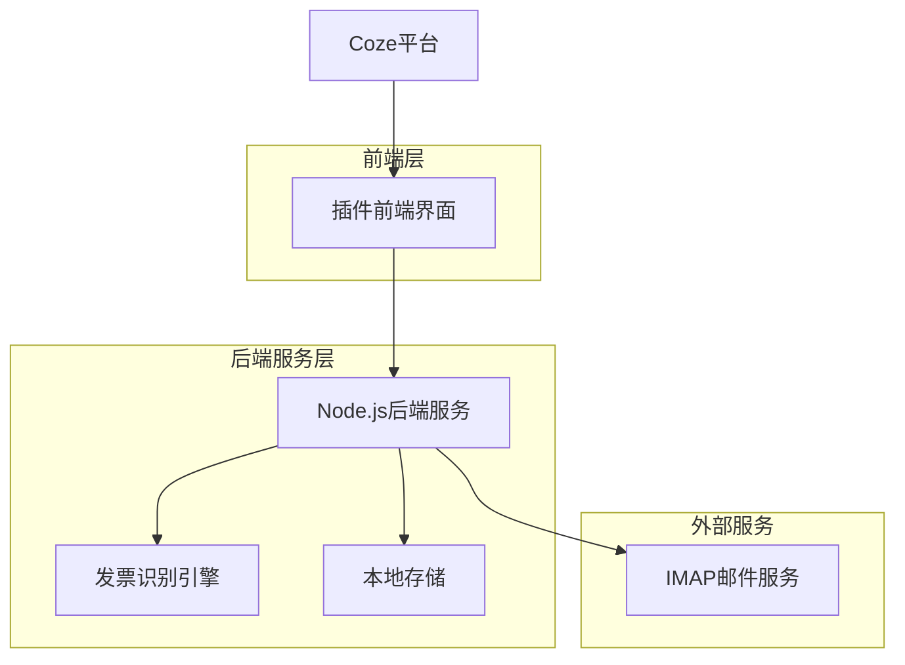
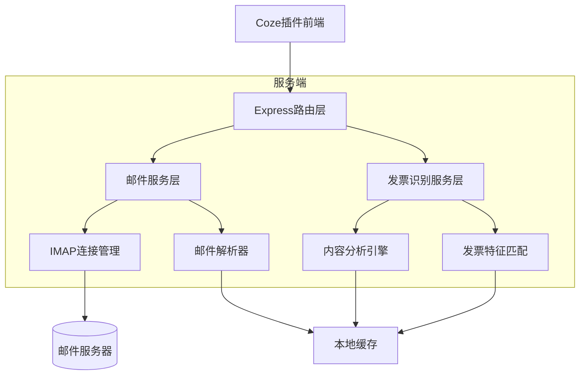
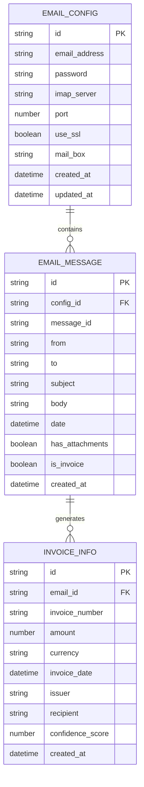

# Coze邮箱插件技术架构文档

## 1. Architecture design



## 2. Technology Description

* Frontend: React\@18 + TypeScript + Ant Design + Vite

* Backend: Node.js\@18 + Express\@4 + TypeScript

* Email: node-imap + mailparser

* AI Recognition: 自然语言处理库 + 正则表达式匹配

* Storage: 本地JSON文件存储

## 3. Route definitions

| Route     | Purpose            |
| --------- | ------------------ |
| /config   | 邮箱配置页面，设置邮箱连接参数    |
| /emails   | 邮件接收页面，显示邮件列表和筛选功能 |
| /invoices | 发票识别页面，展示识别结果和发票信息 |
| /settings | 插件设置页面，配置运行参数和查看日志 |

## 4. API definitions

### 4.1 Core API

邮箱连接测试

```
POST /api/email/test-connection
```

Request:

| Param Name     | Param Type | isRequired | Description |
| -------------- | ---------- | ---------- | ----------- |
| email\_address | string     | true       | 邮箱地址        |
| password       | string     | true       | 邮箱密码或授权码    |
| imap\_server   | string     | true       | IMAP服务器地址   |
| port           | number     | true       | 端口号         |
| use\_ssl       | boolean    | true       | 是否使用SSL     |

Response:

| Param Name | Param Type | Description |
| ---------- | ---------- | ----------- |
| success    | boolean    | 连接是否成功      |
| message    | string     | 连接结果信息      |

获取邮件列表

```
POST /api/email/fetch-emails
```

Request:

| Param Name     | Param Type | isRequired | Description   |
| -------------- | ---------- | ---------- | ------------- |
| email\_address | string     | true       | 邮箱地址          |
| password       | string     | true       | 邮箱密码          |
| imap\_server   | string     | true       | IMAP服务器       |
| port           | number     | true       | 端口号           |
| use\_ssl       | boolean    | true       | 是否使用SSL       |
| mail\_box      | string     | false      | 邮箱文件夹，默认INBOX |
| limit          | number     | false      | 邮件数量限制，默认10   |
| from           | string     | false      | 发件人筛选         |
| since          | string     | false      | 起始日期          |
| to             | string     | false      | 收件人筛选         |

Response:

| Param Name | Param Type | Description |
| ---------- | ---------- | ----------- |
| success    | boolean    | 请求是否成功      |
| emails     | array      | 邮件列表        |
| total      | number     | 邮件总数        |

发票识别

```
POST /api/invoice/detect
```

Request:

| Param Name | Param Type | isRequired | Description |
| ---------- | ---------- | ---------- | ----------- |
| emails     | array      | true       | 邮件数据数组      |

Response:

| Param Name | Param Type | Description |
| ---------- | ---------- | ----------- |
| success    | boolean    | 识别是否成功      |
| invoices   | array      | 识别出的发票邮件    |
| count      | number     | 发票邮件数量      |

Example Request:

```json
{
  "email_address": "test@qq.com",
  "password": "authorization_code",
  "imap_server": "imap.qq.com",
  "port": 993,
  "use_ssl": true,
  "mail_box": "INBOX",
  "limit": 10,
  "since": "2025-01-01"
}
```

## 5. Server architecture diagram



## 6. Data model

### 6.1 Data model definition



### 6.2 Data Definition Language

邮箱配置表 (email\_configs.json)

```json
{
  "configs": [
    {
      "id": "uuid",
      "email_address": "user@qq.com",
      "password": "encrypted_password",
      "imap_server": "imap.qq.com",
      "port": 993,
      "use_ssl": true,
      "mail_box": "INBOX",
      "created_at": "2025-01-20T10:00:00Z",
      "updated_at": "2025-01-20T10:00:00Z"
    }
  ]
}
```

邮件消息表 (email\_messages.json)

```json
{
  "messages": [
    {
      "id": "uuid",
      "config_id": "config_uuid",
      "message_id": "email_message_id",
      "from": "sender@example.com",
      "to": "recipient@qq.com",
      "subject": "发票邮件主题",
      "body": "邮件正文内容",
      "date": "2025-01-20T09:00:00Z",
      "has_attachments": true,
      "is_invoice": true,
      "created_at": "2025-01-20T10:00:00Z"
    }
  ]
}
```

发票信息表 (invoice\_info.json)

```json
{
  "invoices": [
    {
      "id": "uuid",
      "email_id": "email_uuid",
      "invoice_number": "INV-2025-001",
      "amount": 1000.00,
      "currency": "CNY",
      "invoice_date": "2025-01-19T00:00:00Z",
      "issuer": "开票公司名称",
      "recipient": "收票公司名称",
      "confidence_score": 0.95,
      "created_at": "2025-01-20T10:00:00Z"
    }
  ]
}
```

预设邮箱配置 (email\_presets.json)

```json
{
  "presets": [
    {
      "name": "QQ邮箱",
      "imap_server": "imap.qq.com",
      "port": 993,
      "use_ssl": true,
      "domain": "qq.com"
    },
    {
      "name": "163邮箱",
      "imap_server": "imap.163.com",
      "port": 993,
      "use_ssl": true,
      "domain": "163.com"
    },
    {
      "name": "Gmail",
      "imap_server": "imap.gmail.com",
      "port": 993,
      "use_ssl": true,
      "domain": "gmail.com"
    }
  ]
}
```

